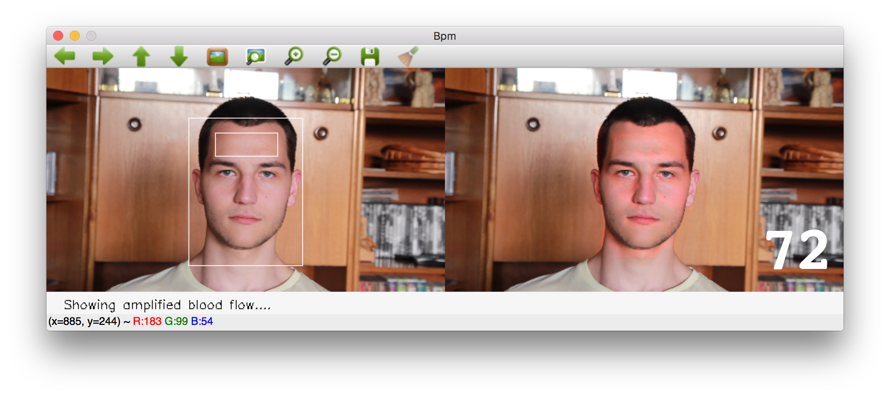

# BPM: Heartbeat detection and visualization from video source
This project is an application, which detects heartbeat frequency of sampled person based on short optical record and figures the heartbeat in eye-catching form to the user. Creating algorithm for detecting the heartbeat is needed for this thesis purpose. Figuring the heartbeat frequency is inspired by [Eulerian Magnification](http://people.csail.mit.edu/mrub/vidmag/) in records.

## Thesis
In [documentation folder](https://github.com/michalsindelar/bpm/tree/master/documentation) is available thesis paper in czech language with detailed information about implementation and theory behind.

### Abstract
The aim of this thesis is an implementation of an application, which detects heartbeat frequency of sampled person based on short optical record and figures the heartbeat in eye-catching form to the user. Creating algorithm for detecting the heartbeat is needed for this thesis purpose. Figuring the heartbeat frequency is inspired by Eulerian Magnification in records.

Thesis at first explores physiological consequences of blood circulation in the skin, which could be suitable for detecting the heartbeat. After comparing different options is analysis of skin's hue fluctuation due to blood circulation chosen for detecting. Then theoretical describing possible technique for detecting final heartbeat from measured hue changes follows. This technique uses temporal frequency domain created with Fourier transform. Final heartbeat is gathered from found strongest frequency in acceptable beat interval set from statistical data about human heartbeat.

In practical part is described implemented application in OpenCV environment and demonstrated its functionality on input record. Also, requirements on input record are discussed here. It must have at least 500 frames with minimal sampling rate twice higher than the actual heartbeat frequency. It is very important to assure stable position of the measured face. In the end are described measurements of heartbeat from various records which accomplish input's requirements. Maximal measurement error is about 5% bpm.

## Output samples
Video samples outputs are available in external [cloud storage](https://app.box.com/s/mrfgf7ximq980dwm3mwnod3dhpzm185w). Folders and video files are named based on real heartbeat measured via blood pressure monitor. Several files are generated in each folder such as measured csv table comparing different settings for detecting pulse, different number of used frames etc.

## Further projects and visions
- [BPMonitor](https://github.com/michalsindelar/BPMonitor)
    - Experimental application to monitor heart rate during work in front of notebook using integrated camera, which informs user about potential dangerous heart rate.
- [Awake Monitor](https://github.com/michalsindelar/awakeMonitor)
    - Vision how to prevent driver to fall asleep via heart rate monitoring.
- [SMirror](https://github.com/michalsindelar/SMirror)
    - Long time vision of smart mirror with face detection authentication, heart rate detect, widgets on dashbord and lot more.

## Dependencies
* C++
* OpenCv > 2
  * --with-ffmpeg support
  * --with-qt support
* Qt5 framework
* CMake > 3

## How to run
Install all dependencies at first. You can try run executable file `bpm` on OS X.

### Unix based system
Prefered way with brew (linuxbrew).

`brew install opencv -v --with-ffmpeg --with-qt --c++11`

`brew install qt5`

`brew linkapps qt5`

`brew install moc` - auto mock needed for qt

---

App is compiled via CMake. Navigate to app in terminal folder. Folder must be __writable__, you could run:

`chmod 777 ./`

Then run following commands:

`cmake .`

`make`

`./bpm`

For better performance you could try increasing priority of process especially when using webcamera.

`$ nice -n -10 ./bpm`

Enjoy!

## TODO list
[ ] Fix Windows compatibility

